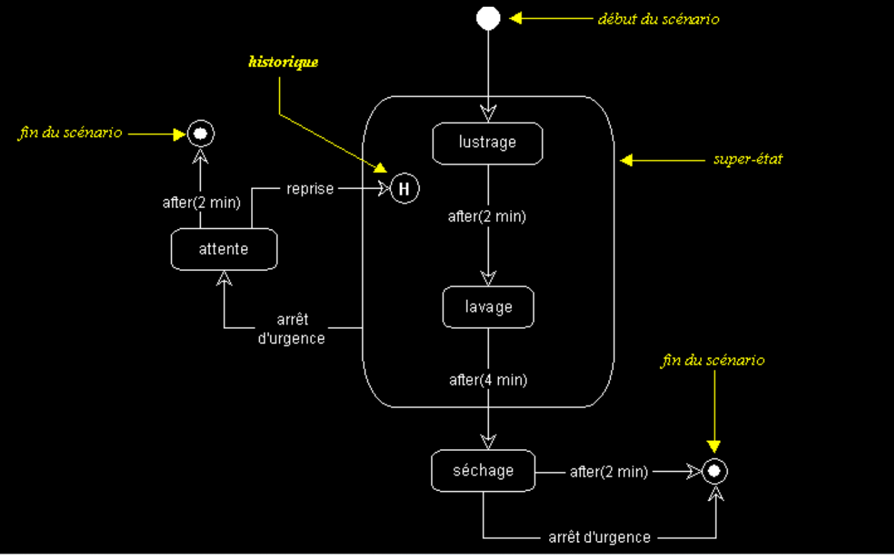

# Exercice 4

---

## Sources des images

- [Diagramme d'état-transition de uml.free.fr](http://uml.free.fr/cours/i-p20.html)

---

## Enoncé

**Les travaux à effectuer ci-arpès doivent être effectué à partir de votre réalisation de l'exercice 3.**
1. A partir de ce [template](./ressources/uc_details.xlsx), **détaillez un cas d'utilisation** de votre choix.
2. En vous appuyant sur l'exemple ci-dessous d'un ***diagramme d'état-transition***, representez les différents états de la disponibilité d'un logement dans le cas d'**une réservation du logement**.

---

### Exemple diagramme d'état transition

