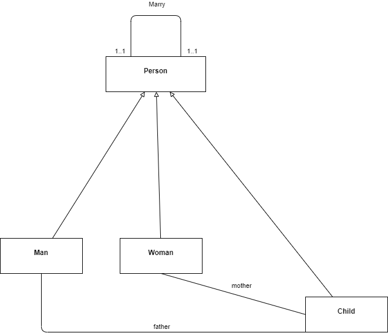

# Exercice 6

1. Modélisez à l'aide d'un ***diagramme de classe***, le système de parrainage entre un client (parrain) et plusieurs futures clients (filleuls).

2. Proposez un autre diagramme de classe pour tenir compte des exigeances suivantes :
- Une personne peut se marier plusieurs fois au cours de sa vie mais la polygamie reste interdite.
- Un enfant peut être orphelin, avoir un ou plusieurs papas et/ou un ou plusieurs mamans.
