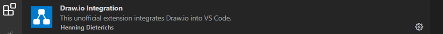

# Installation

---

## Algorithme et programmation

Si vous avez déjà cet éditeur ou un autre pas besoin de faire ou refaire l'installation

- [Editeur de code VSCODE](https://code.visualstudio.com/download)

---

## UML

### Extension draw.io VSCODE à télécharger

Ajoutez l'extension *VSCode draw.io Integration*

## Travailler en ligne

- [diagrams.net](https://app.diagrams.net/)

Pour ces outils (diagrams.net et son extension VSCODE), il convient de ne garder que les diagrammes UML en déchochant toutes les autres.
- [escalidraw](https://excalidraw.com/) : ce n'est pas un outil dédié pour UML donc il faudra si vous l'utilisez vous eforcez de respecter les standards du langage UML

### AUTRES SOLUTIONS A CONNAITRE MAIS PAS BESOIN DE LES INSTALLER DANS LE CADRE DE CE COURS

- [Logiciel StarUML](https://staruml.io/download) avec sa [Documentation](https://docs.staruml.io/)
- [Lucidchart outil payant avec une base gratuite](https://lucidsoftware.grsm.io/uml)
- [Edraw payant](https://www.edrawsoft.com/edraw-uml.html?src=cj&cjevent=9ae1d21ec0e911ee82cc5bb90a18ba73)
- [Gliffy payant](https://www.gliffy.com/)
- [GitMind](https://gitmind.com/fr/diagramme-uml.html)

